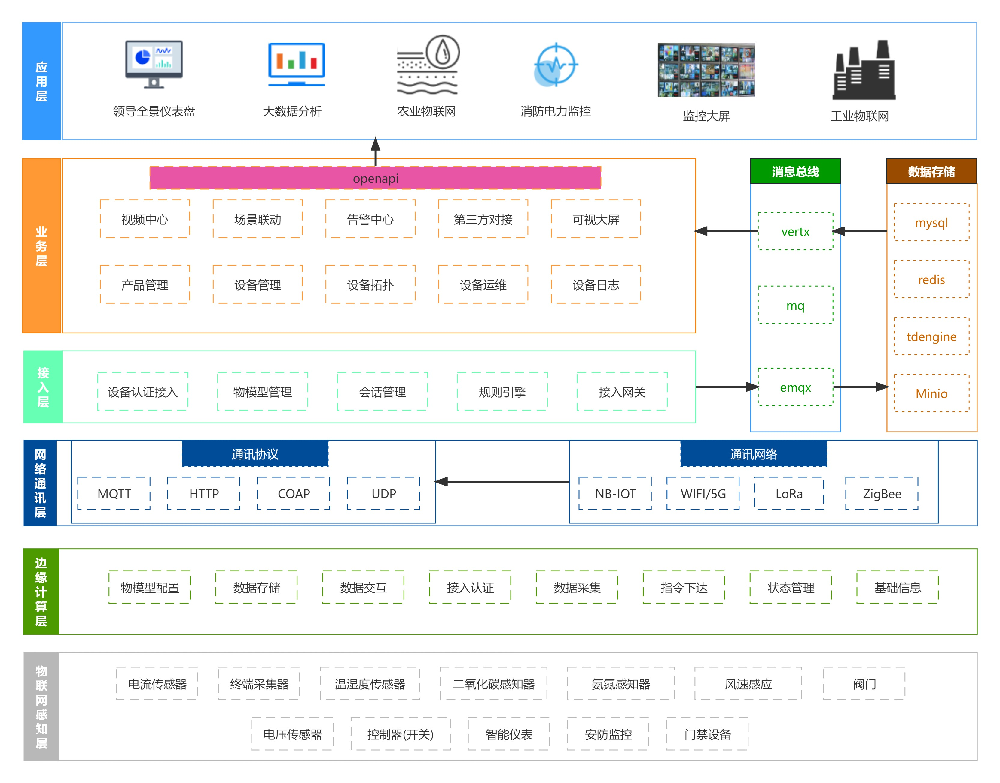

- - -
## 写一个开箱即用的物联网项目捐献给Dromara组织
### 一、平台简介

1. MzMedia开源视频联动物联网平台，简单易用，更适合中小企业和个人学习使用。适用于智能家居、农业监测、水利监测、工业控制，车联网，视频联动等场景。

2. 支持抖音，快手，视频号等主流短视频平台推流直播，提取视频切片等功能

3. 系统后端采用Spring boot；前端采用Vue3+Element Plus；消息服务器采用EMQX5.0；数据库采用Mysql、TDengine和Redis；设备端支持OpenWrt,FreeRTOS,RT-Thread等操作系统的接入sdk；

4. 本项目使用了多个Dromara组织框架和工具，包括：RuoYi-Vue-Plus，hutool，Sa-Token，LiteFlow，Forest，sms4j，go-view等，取之于Dromara组织，贡献于Dromara组织。

5. 系统架构图
   

> RuoYi-Vue-Plus 是重写 RuoYi-Vue 针对 `分布式集群与多租户` 场景全方位升级

> 项目代码、文档 均开源免费可商用 遵循开源协议在项目中保留开源协议文件即可 
活到老写到老 为兴趣而开源 为学习而开源 为让大家真正可以学到技术而开源

> gitee: [MzMedia](https://gitee.com/mzmedia/mz-media)

> github: [MzMedia](https://github.com/MzMedia/MzMedia.git)

> 文档地址: [MzMedia](https://mzmedia.github.io/)
 
> 系统演示: [传送门](https://plus-doc.dromara.org/#/common/demo_system)

### 二、系统功能

#### 1.框架系统功能
| 功能         | 本项目                                                                                                              | 
|------------|-------------------------------------------------------------------------------------------------------------------|
| 前端项目       | 采用 Vue3 + TS + ElementPlus 重写                                                                                     | 
| 后端项目结构     | 采用插件化 + 扩展包形式 结构解耦 易于扩展                                                                                           | 
| 关系数据库支持    | 原生支持 MySQL、Oracle、PostgreSQL、SQLServer 可同时使用异构切换                                                              | 
| 缓存数据库      | 支持 Redis 5-7 支持大部分新功能特性 如 分布式限流、分布式队列                                                                             | 
| ORM框架      | 采用 Mybatis-Plus 基于对象几乎不用写SQL全java操作 功能强大插件众多 例如多租户插件 分页插件 乐观锁插件等等                                             | 
| 文件存储       | 采用 Minio 分布式文件存储 天生支持多机、多硬盘、多分片、多副本存储 支持权限管理 安全可靠 文件可加密存储                                                     | 
| 云存储        | 采用 AWS S3 协议客户端 支持 七牛、阿里、腾讯 等一切支持S3协议的厂家                                                                          | 
| 短信，邮件        | 采用 sms4j 短信融合包 支持数十种短信厂家 只需在yml配置好厂家密钥即可使用 可多厂家共用                                                                 |
| 接口文档       | 采用 SpringDoc、javadoc 无注解零入侵基于java注释 只需把注释写好 无需再写一大堆的文档注解了                                                     | 
| 工具类框架      | 采用 Hutool、Lombok 上百种工具覆盖90%的使用需求 基于注解自动生成 get set 等简化框架大量代码                                                       | 
| 代码生成器      | 只需设计好表结构 一键生成所有crud代码与页面 降低80%的开发量 把精力都投入到业务设计上 框架为其适配MP、SpringDoc规范化代码 同时支持动态多数据源代码生成                    | 
| 部署方式       | 支持 Docker 编排 一键搭建所有环境 让开发人员从此不再为搭建环境而烦恼                                                                           | 

#### 2.物联网系统功能
| 功能               | 介绍                                                                                | 
|------------------|-----------------------------------------------------------------------------------|
| MQTT协议支持         | 集成emqx5.0 mqtt消息中间件,支持MQTT (3.1、3.1.1和5.0)等协议标准                                   |
| 视频监控协议支持         | 集成ZLMediaKit流媒体服务器，支持GB28181国标协议，支持RTSP,RTMP,RTP等流媒体协议，支持海康威视，大华等主流监控设备           |
| 主流modbus,PLC协议支持 | 集成ModbusTCP服务器和ModbusRTU解码器，支持主流工控设备数据上报方式，支持MQTT透传,TCP透传，ModbusTCP等方式，可对接主流PLC设备 |
| 物模型规范            | 有标准的物模型字段，根据属性，功能，事件来处理设备业务，支持灵活的key-value编码解析                                    |
| 消息编码管理           | key-value编码可自定义调整，可使用规则引擎对消息进行简单处理                                                |
| 设备接入协议管理         | 支持mqtt,sip,http,tcp,udp,tr069,lora等网络组件接入，可启停，可横向拓展。                              |
| 细粒度的时序数据库记录      | 集成TDengine时序数据库，可记录每个设备的属性和事件历史数据，可进行大数据处理和展示                                     |
| 更加灵活的规则引擎        | 集成 node-red + liteflow 框架，作为业务解耦核心组件，更加方便拓展，                                      |
| 设备拓扑，设备组态        | 集成 ShadowEditor 框架，动态展示设备实时运行状态，可根据需要开启                                           |
| 数据可视化            | 集成GoView框架，可拖拽可视化大屏，项目整体数据展示更加炫酷                                                  |
| 三方系统对接           | 集成Forest框架，高层的、极简的轻量级HTTP调用API框架。                                                 |
| 设备sdk开发          | 支持主流物联网操作系统 ESP-IDF，openwrt                                                       |

### 三、技术栈
* 服务端
    - 相关技术：Spring boot、Mybatis-Plus、Sa-Token、Jwt、Mysql、Redis、TDengine、EMQX5.0、Vertx等
* Web端
    - 相关技术：Vue3、TS、Element Plus、Vite等
* 可视化大屏(GoView)
    - 相关技术：Vue、TypeScript4、Vite、NaiveUI、ECharts、Pinia等
* 组态(ShadowEditor)
    - 相关技术：Vue、ElementUI、Three.js、Go、MongoDB等
* 规则引擎（node-red+liteflow）
    - 相关技术：nodejs、html、js等
* 流媒体服务器（zlmediakit）
    - 相关技术：c++、sip、gb28181、rtmp、rtsp、flv、ffmpeg、ffprobe等
* 硬件端
    - 相关技术：ESP-IDF、Arduino、openwrt、freeos、rt-thread等

### 四、本项目业务特性

#### 1.框架业务特性
| 业务     | 功能说明                                                                 | 本项目    |
|--------|----------------------------------------------------------------------|--------|
| 租户管理   | 系统内租户的管理 如:租户套餐、过期时间、用户数量、企业信息等                                      | V1.0支持 |
| 租户套餐管理 | 系统内租户所能使用的套餐管理 如:套餐内所包含的菜单等                                          | V1.0支持     | 
| 客户端管理  | 系统内对接的所有客户端管理 如: pc端、小程序端等 支持动态授权登录方式 如: 短信登录、密码登录等 支持动态控制token时效 | V1.0支持     | 
| 用户管理   | 用户的管理配置 如:新增用户、分配用户所属部门、角色、岗位等                                       | V1.0支持     |
| 部门管理   | 配置系统组织机构（公司、部门、小组） 树结构展现支持数据权限                                       | V1.0支持     |
| 岗位管理   | 配置系统用户所属担任职务                                                         | V1.0支持     | 
| 菜单管理   | 配置系统菜单、操作权限、按钮权限标识等                                                  | V1.0支持     |
| 角色管理   | 角色菜单权限分配、设置角色按机构进行数据范围权限划分                                           | V1.0支持     | 
| 字典管理   | 对系统中经常使用的一些较为固定的数据进行维护                                               | V1.0支持     | 
| 参数管理   | 对系统动态配置常用参数                                                          | V1.0支持     | 
| 操作日志   | 系统正常操作日志记录和查询 系统异常信息日志记录和查询                                          | V1.0支持     | 
| 登录日志   | 系统登录日志记录查询包含登录异常                                                     | V1.0支持     | 
| 文件管理   | 系统文件展示、上传、下载、删除等管理                                                   | V1.0支持     | 
| 文件配置管理 | 系统文件上传、下载所需要的配置信息动态添加、修改、删除等管理                                       | V1.0支持     | 
| 在线用户管理 | 已登录系统的在线用户信息监控与强制踢出操作                                                | V1.0支持     |
| 定时任务   | 运行报表、任务管理(添加、修改、删除)、日志管理、执行器管理等                                      | V1.0支持     | 
| 代码生成   | 多数据源前后端代码的生成（java、html、xml、sql）支持CRUD下载                              | V1.0支持     | 
| 系统接口   | 根据业务代码自动生成相关的api接口文档                                                 | V1.0支持     | 
| 服务监控   | 监视集群系统CPU、内存、磁盘、堆栈、在线日志、Spring相关配置等                                  | V1.0支持     | 
| 缓存监控   | 对系统的缓存信息查询，命令统计等。                                                    | V1.0支持     | 
| 在线构建器  | 拖动表单元素生成相应的HTML代码。                                                   | V1.0支持     |

#### 2.物联网业务特性
| 业务       | 功能说明                                                  | 本项目    |
|----------|-------------------------------------------------------|--------|
| 产品管理     | 产品详情、产品物模型、产品分类、设备认证码、告警规则                            | V1.0支持 | 
| 设备管理     | 设备详情、设备分组、设备日志、设备分享、OTA升级、设备实时控制、实时状态、数据监测            | V1.0支持 | 
| 物模型管理    | 属性（设备状态和监测数据），功能（设备可远程调用的功能），事件（设备告警事件和状态事件）          | V1.0支持 | 
| 数据流转     | 可视化规则引擎编写，支持js,java等脚本修改消息结构，第三方系统对接，场景联动             | V1.0支持 | 
| 设备运维     | 设备固件管理，设备在线调试，设备组态，设备拓扑，设备配置模板下发                      | V1.0支持 | 
| 视频中心     | 基于GB/T28181协议支持主流厂商监控设备接入，多路视频直播、回放、本地录制查询，云端录像和云台控制， | V1.0支持 | 
| 数据可视化    | 数据可视化，将图表或页面元素封装为基础组件，无需编写代码即可完成业务需求                  | V1.0支持 | 
| 视频中心（拓展） | 支持onvif,rtsp等协议接入，支持海康，大华，萤石云等厂商sdk调用，支持语音对讲          | V2.0支持 | 
| AI分析     | 支持百度视联网平台对接，支持算子训练和各种识别模型配置，包括人员，车辆，动物，物体等            | V2.0支持 | 
| 网络设备管理   | 支持TR069，SNMP协议接入的网络设备管理，支持TR098,TR181等标准数据模型，支持网络拓扑展示 | V2.0支持 | 

### 五、项目目录
> ui --------------------------- 前端项目 
> devsdk ----------------------- 设备端sdk 
> script ----------------------- docker部署脚本和sql数据库脚本 

### 六、开源项目持续性规划
1. 广告位和厂商赞助
2. 技术支持服务
3. 应用商店模块售卖，标准模块拓展，协议包，功能包等
4. 项目提炼商业版本授权
5. 项目成熟后设备托管服务和定制开发服务

### 七、贡献

目前缺前端大佬一名,移动端大佬一名 要求:
1. 有开源精神,愿意长期献身开源项目，
2. 对物联网项目感兴趣,技术栈为“Vue3、TS、Element Plus”最佳，
3. 有能力使用主流前端框架重写现有功能页面，能开放移动端小程序最佳
4. 会根据贡献共享开源收入。

### 八、参考文档

使用本项目前请仔细阅读文档重点注意事项
 
>[部署项目 必看](https://plus-doc.dromara.org/#/ruoyi-vue-plus/quickstart/deploy)
>>[https://plus-doc.dromara.org/#/ruoyi-vue-plus/quickstart/deploy](https://plus-doc.dromara.org/#/ruoyi-vue-plus/quickstart/deploy)
> 
>[参考文档 Wiki](https://plus-doc.dromara.org)
>>[https://plus-doc.dromara.org](https://plus-doc.dromara.org)

### 九、其他

* 定期同步升级 RuoYi-Vue-Plus 有用的更新

### 十、演示图例

|                                                                                            |                                                                                            |
|--------------------------------------------------------------------------------------------|--------------------------------------------------------------------------------------------|
|  |  |
|  |  |
|  |  |
|  |  |
|  |  |
|  |  |
|  |  |
|  |  |
|  |  |
|  |  |
|  |  |
|  |  |
|  |  |
|  |  |
|  |  |
|  |  |
|  |  |
|  |  |
|  |  |

